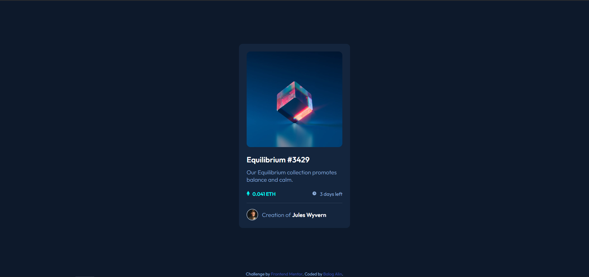

# Frontend Mentor - QR code component solution

This is a solution to the [NFT preview card component](https://www.frontendmentor.io/challenges/nft-preview-card-component-SbdUL_w0U). Frontend Mentor challenges help you improve your coding skills by building realistic projects.

## Table of contents

- [Overview](#overview)
  - [Screenshot](#screenshot)
  - [Links](#links)
- [My process](#my-process)
  - [Built with](#built-with)
  - [What I learned](#what-i-learned)
  - [Continued development](#continued-development)
- [Author](#author)

## Overview

### Screenshot

### Links

- Solution URL: [Add solution URL here](https://your-solution-url.com)
- Live Site URL: [Add live site URL here](https://your-live-site-url.com)

## My process

### Built with

- Mobile-first workflow
- Semantic HTML5 markup
- CSS custom properties
- Flexbox
- Transitions

### What I learned

- I have grasped the idea of mobile first workflow
- A better understanding of flexbox
- I can say i became proficient at card styles

### Continued development

- I would like to do some more advanced works, i will use this as a stepping stone into junior level projects

## Author

- Balog Alin
- linkedIn - [@alinbalog](https://www.linkedin.com/in/alinbalog/)
- github - [@Fabzus](https://github.com/Fabzus)
- Frontend Mentor - [@Fabzus](https://www.frontendmentor.io/profile/Fabzus)
